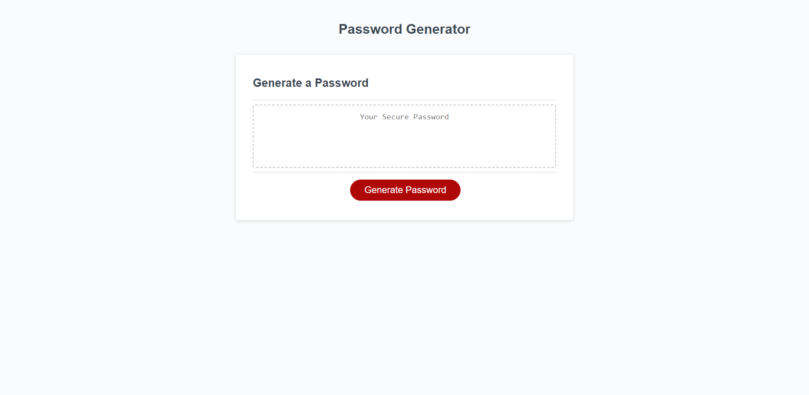

# <Password Generator>

## Description

It has become increasingly harder to create a password that meets the criteria for required character types from different websites, that also is secure enough to avoid being compromised. In order to meet both of these requirements, this password generator will provide a random string of characters based on whether a user requests small caps characters, large caps characters, numbers and symbols. 

## Installation

N/A

## Usage

To use the Password Generator, click the Generate Password button.

You will be prompted to select the number of characters (between 8 and 128). If you select a number outside of this range, you will be prompted to select a new number.

Follow the prompts for choosing the types of characters you wish to have in your password. You must select at least one type or the password generator will throw an error and begin back at the start.

Once all prompts have been answered successfully, you can copy and paste your new password from the text box. 

